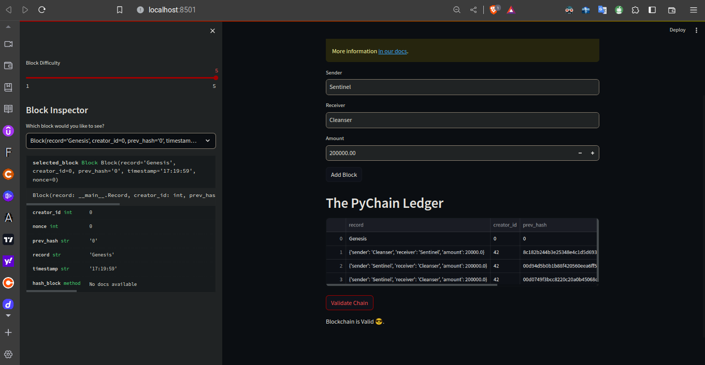

# PyChain Streamlit Application

This Streamlit application demonstrates a simple blockchain implementation, where users can input transaction details, that is, sender, receiver, and amount to create blocks, which are then added to the blockchain.

## How to Run the Application

1. Ensure you have Python and the necessary libraries installed:
   - Streamlit: `pip install streamlit`
   - pandas: `pip install pandas`

2. Clone the repository and navigate to the project folder:

3. Run the Streamlit application:

4. In the application, enter the sender, receiver, and amount for a transaction, then click "Add Block" to store the transaction record as a block in the PyChain.

5. You can adjust the block difficulty using the slider in the sidebar to see the proof-of-work mechanism.

6. Explore the blockchain ledger and inspect individual blocks using the interface.

7. Click "Validate Chain" to verify the integrity of the blockchain. 

The following pic shows a screenshot of the Stremlit application after a successful validation of the blockchain.

## Application Structure

- The blockchain is implemented using a simple data structure consisting of blocks.
- Each block contains a record representing a financial transaction.
- Proof of work is implemented to secure the blockchain.
- The interface is built using Streamlit for easy interaction.

## Files in the Project

- `pychain.py`: Contains the Python code for the blockchain implementation and the Streamlit application.
- `README.md`: This file providing an explanation of the Streamlit application.
